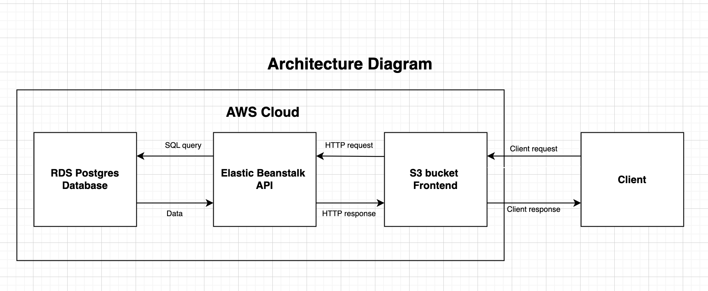

### Infrastructure Description

#### The infrastructure of the application is deployed on AWS
- RDS postgres is the database storage.
- Elastic Beanstalk stores the API code and run the server.
- S3 stores static files and frontend code.

### Architecture Diagram

