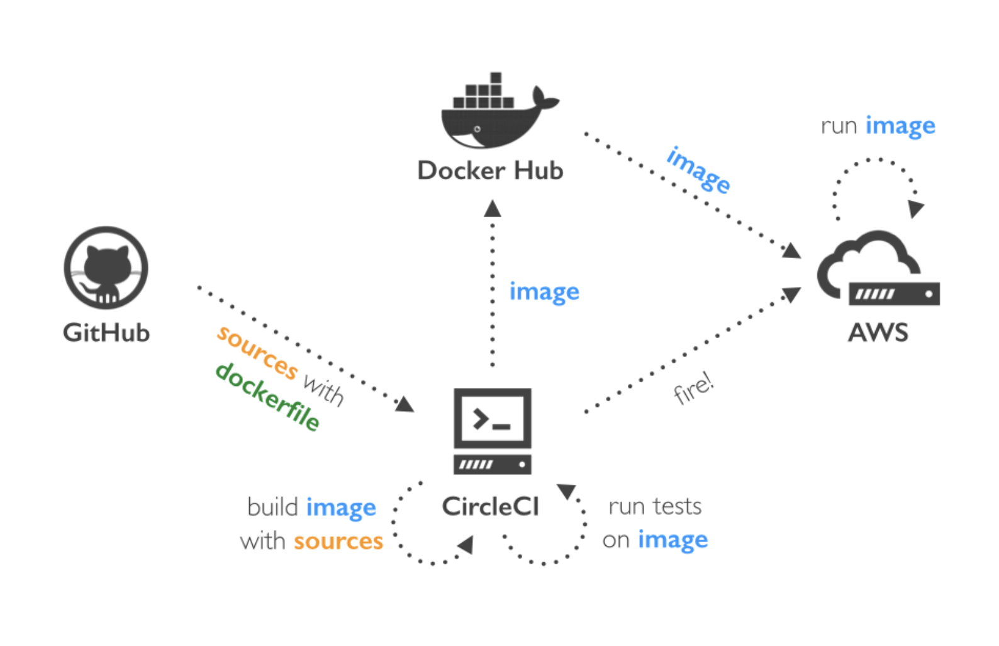

# Pipeline Process

## CircleCI is used to build this pipeline

 

### The configuration of the pipeline contains:

 

#### 1- First, CircleCI install node and aws cli and eb cli

#### 2- Next circleCI checks if there are any changes made to the repo uisng the checkout process

#### 3- Then CircleCI installs the frontend and the backend dependencies

#### 4- After, CircleCI builds the frontend and the backend to make ready for production

#### 5- After, CircleCI deploys the frontend to S3 bucket and the backend to EB

 

### Pipeline illustration

