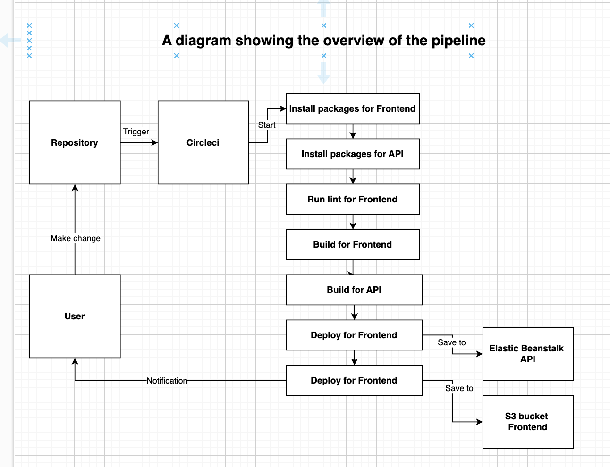

### Pipeline Description

#### The configuration of the pipeline contains:
**Circleci will:**
1. Check if there are any changes in the repo using the checkout process
2. Install packages of frontend, api
3. Setup aws-cli and elastic beanstalk (EB)
4. Start check lint for frontend
5. Build the frontend and the api for production version
6. Deploy the frontend to S3 bucket and the backend to EB
7. Notify a notification for user 

### Diagram Pipeline

